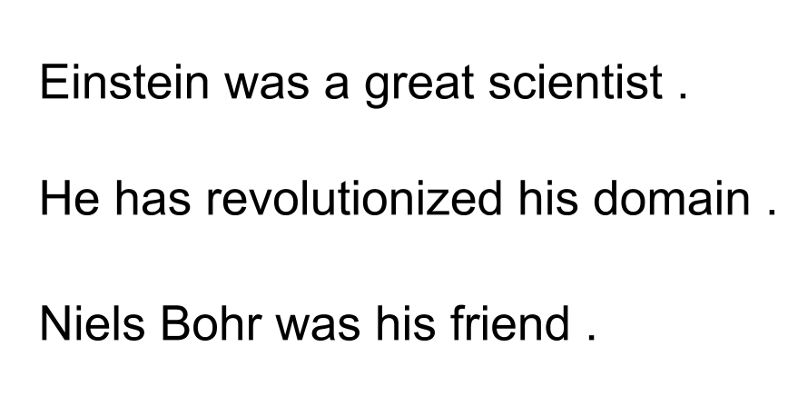

# Noisy-Text
>Add noise to your text, inspired by [Edunov et al. (2018)](https://arxiv.org/abs/1808.09381) "Understanding Back-Translation at scale"

> Made at Qwant Research during my internship

<p align="center">
  
</p>

It is often a good idea to add noise to your syntetic text data, when using backtranslation for example

[Edunov et al. (2018)](https://arxiv.org/abs/1808.09381) showed that doing so can help to provide a stronger training signal


This repository contains:
- A script to reproduce experiments described by [Edunov et al. (2018)](https://arxiv.org/abs/1808.09381) in their noise approach
- A simple architecture so you can play with noise parameters or implement your own noise functions

## Installation

Libraries you'll need to run the project:

{``tqdm``}

Clone the repo using

```sh
git clone https://github.com/valentinmace/noisy-text.git
```

## Usage
I've implemented the 3 noise functions described in the paper:

1. Delete words with given probability (default is 0.1)
2. Replace words by a filler token with given probability (default is 0.1)
3. Swap words up to a certain range (default range is 3)

The default parameters are to reproduce [Edunov et al. (2018)](https://arxiv.org/abs/1808.09381) experiments but you can play with them and maybe find better values

Example of simple usage
```sh
python add_noise.py data/example --progress
```
Example of complete usage
```sh
python add_noise.py data/example --delete_probability 0.9 --replace_probability 0.9  --filler_token 'MASK' --permutation_range 3
```

**Important Note**

If you are using a subword tool such as SentencePiece after adding noise to your corpus, notice that your replacement token (which is ``'BLANK'`` by default) might be segmented into somthing like ``'▁B LAN K'``

I recommend to make a pass on your corpus to correct it: (adapt it to your token and segmentation)
```sh
sed -i 's/▁B LAN K/▁BLANK/g' yourtextfile
```

## Results

I've run NMT experiments on WMT 2019 de-en corpus, using all available parallel data and adding the monolingual news-crawl 2018 via backtranslation.

After translating it from german to english to have my syntetic data, I added noise to it using this repo, giving the following results. All results are BLEU Scores

The first table reports a Transformer model identical to the "base model" in [Vaswani et al. (2017)](https://arxiv.org/pdf/1706.03762.pdf), the second table reports a "Transformer Big" model, from the same paper

| Model  | newstest2017 | newstest2018 |
| ------------- | ------------- | ------------- |
| baseline  | 26.62  | 40.47  |
|  backtranslation only | 27.06  | 40.06  |
|  backtranslation + noise | **27.88**  | **41.92**  |

*Transformer base model*

| Model  | newstest2017 | newstest2018 |
| ------------- | ------------- | ------------- |
| baseline  | 29.75  | 45.8  |
|  backtranslation + noise | **31.33**  | **47.4**  |

*Transformer Big model*


## Notes

Do not hesitate to contact me if you need some help, need a feature or see some bug

Feel free and welcome to contribute


## Meta

Valentin Macé – [LinkedIn](https://www.linkedin.com/in/valentin-mac%C3%A9-310683165/) – [YouTube](https://www.youtube.com/channel/UCMIW0JKxoxBDM5yiiF17SrA) – [Twitter](https://twitter.com/ValentinMace) - valentin.mace@kedgebs.com

Distributed under the MIT license. See ``LICENSE`` for more information.
